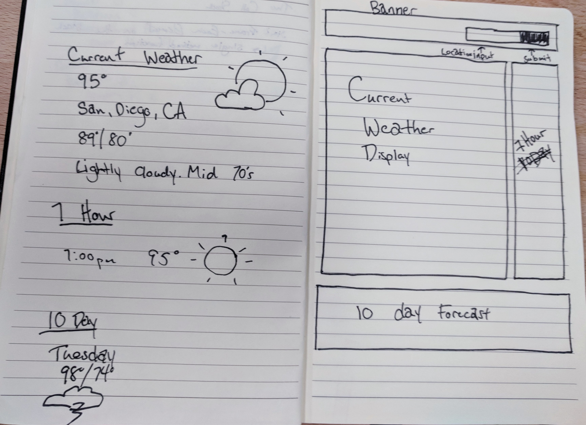

**Context**
It’s important to know what Mother Nature is going to throw at you each day – what if you wear flip flops because it’s sunny and 65 degrees in the morning and then it snows all afternoon (this is Colorado, after all).

As web developers you’re going to be living in the context of the web. With this next project you will be interacting with a web-api. Ultimately this is going to be a preview for what the real world is going to look like for most of you. Data is important and thats what the API provides. As a web-developer you will be giving value to that data by visualizing and organizing that data for your user base.

In this project you will be getting your first real interactions with ReactJS, asynchronous javascript, and managing the state of your application.

**Wireframe**

